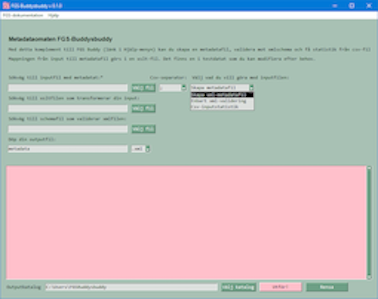
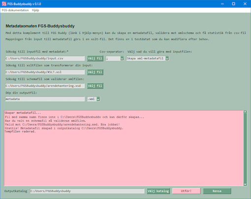

# FGS Buddysbuddy :sunglasses:

 

En GUI-försedd metadataomat inom Buddy-projektet. Buddy-projektet vänder sig främst till arkivarier och sådana som håller på med strukturerad metadata inom arkivdomänen, men alla är förstås välkomna!

---

## Features :star:
* Huvudarbetsprocess:
  *   Välj antingen csv-fil med rubriker (encoding utf-8, defaultseparator är semikolon) eller en xml-fil med flat strutur.
  *   Välj matchande xslt-fil där rubrikerna i csv-filen eller taggar i xml-filen mappar mot värden i xslt-filen.
  *   Välj xml-schemafil (.xsd) om du vill validera filen i samband med skapandet.
  *   Namnge xml-outputfilen (om du vill ändra default).
  *   Välj outputkatalog (om du vill ändra default).
  *   Skapa filen!
  *   Gå till [FGS Buddy](https://github.com/Viktor-Lundberg/FGSBuddy) med filen och infoga i FGS-paketet.
* Samt:
	* Validera färdig xml-fil separat
	* Plocka ut statistik från csv-inputfil
	
	Se även systemtestcasen redovisade i releasenotes. I mappen Testdata finns testfiler som kan användas för att bekanta sig med Buddysbuddy.

---

## Ideas :star:
* Funktion för uuid-tilldelning (nu "hårdkodad")
* Jämföra inputdata med outputdata i syfte att säkerställa processuell kvalitet
* Editering av xslt och ev schematron
* Xml till csv-konvertering
* Ta fram .exe-fil för Windows
* Ta fram .dmg-fil för Mac
* Language-files
* Anpassa testdatat till FGS 2.0

---

## Kom igång :rocket:

1. [Ladda ner den senaste releasen av FGS-Buddysbuddy.](https://github.com/s99mol/FGSBuddysbuddy)
2. Kör py-filen med Python 3 (eller be Buddy-projektet att snabba på med .exe-versionen).
3. Arbeta enligt Feautures ovan.
  
---

## Kända problem/fix :warning:

* Rekommendation: Installera FGS-buddysbuddy på en lokal disk (exempelvis c:). Applikationen kan ta lång tid att starta om den körs från en nätverksdisk. 
* Rekommendation: Kör skriptet och de framtida programfilerna från katalog du som användare har skrivbehörighet till. Fil skrivs till current working directory i de flesta funktionerna.
* Tooltips på flera rader laddas inte alltid. - workaround flytta muspekaren från fältet och försök igen.
* Det går säkert att lägga in mer exception-hantering.
* Uuid-tilldelningen finns endast för specifik mappning.
* Huvudmenyn fungerar inte på Mac, åtminstone inte M1.
* Allmän koduppstädning och bättre lösningar.
* Missvisande felmeddelande när man försöker skapa statistik från en xml-fil.
* På Mac får kolumnerna i statistikoutputen i det stora fönstret inte rak vänsterjustering.
* Om man först angett schemafil och sedan vill köra utan kan det vara nödvändigt att starta om programmet.
* Fixa i testmappens testxslt.xsl så att tomma taggar utesluts.
* Det ska vara FGS Buddysbuddy och inte FGS-Buddysbuddy

---

## Credits :trophy:

* Viktor Lundberg - Har bidragit med FGS Buddy, som FGS Buddysbuddy utgått ifrån och använt som mall, samt agerat bollplank.
* Glasögon till ikonen hämtade från - http://clipart-library.com/  

---
 
 This work is licensed under a <a rel="license" href="http://creativecommons.org/licenses/by-nc/4.0/">Creative Commons Attribution-NonCommercial 4.0 International License</a>.

