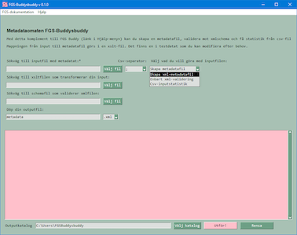
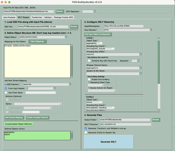

# FGS Buddysbuddy v 0.3.0 :sunglasses:

  En GUI-försedd metadataomat inom Buddy-projektet. Buddy-projektet vänder sig till arkivarier och sådana som håller på med metadata inom arkivdomänen, och alla andra.
<br/>
<br/>A GUI-equipped metadataomat within the Buddy Project. The Buddy Project is for those working with metadata within the archival domain, and everyone else.
<br/>
<br/>
<br/>
<br/>
<br/>

---

## Features (more info to come) :star:
* Tab 1 Input Analyser: Preview data as table and by selected hierarchy keys. Pass selected keys to XSLT Mapper.
* Tab 2 XSLT Mapper: Map input file headers to schema (xsd) and genereate xslt mapping file. Option to generate, transform and validate in one go.
	* Please note that mapping of keys are done in 3. Configure XSLT Hierarchy.
* Tab 3 Transformer: Transform with optional xsd validation
* Tab 4 Validator: Validate against xsd or Schematron (sch).
* Tab 5 Package Creator: A reference to FGS Buddy
	
	[](Screenshots/fgsbuddysbuddy_screen1_big.png "Stor skärmdump 1")[](Screenshots/fgsbuddysbuddy_screen2_big.png "Stor skärmdump 2")

---

# FAQ :question:

* Vilka egenskaper bör min csv-inputfil ha? Varför fungerar det inte med min csv-fil?<br/>
  Svar:
  * Encoding: UTF-8 is recommended.
  * Headings without blanks and "konstiga tecken" as '/' (å, ä, ö går bra, även '_' och '-').
  * Defaultseparator is semi colon (';') but can be changed and there is function in place to 'guess' separator.
  * Får du inte någon output från sista raden, kolla att det finns radavslutningstecken, vilket skapas om sista raden är en blankrad.
  * Ett vanligt fel är att antalet separatorer inte stämmer med rubrikraden. Exempelvis kan ett semikolon i en sträng tolkas som separator.
* Varför måste min csv-fil ha rubriker? <br/>
  Svar: Det måste finnas en första rad med rubriker därför att det är dessa som i xslt-filen mappas in i xml-taggarna. Exempel:
  
  
  	```
   <Skapad> (xml-element som skrivs till xml-outputfilen)
		<xsl:value-of select="Skapad_Arende"/> ('Skapad_Arende' kommer ursprungligen från csv-filens rubrikrad.)
   </Skapad>
	``` 

---

## Ideas :star:

- [ ] Implement better support for DILCIS.eu/XML/ERMS (see Known issues)
- [ ] New tab Output Analyser
- [ ] XSD Analyser
- [ ] Extract metadata from files


---

## Kom igång :rocket:

1. [Ladda ner den senaste releasen och packa upp på lämplig plats.](https://github.com/s99mol/FGSBuddysbuddy/releases)
2. Kör py-filen med Python 3 (eller be Buddy-projektet att snabba på med .exe-versionen).
3. Arbeta enligt Feautures ovan.
  
---

## Known issues :warning:

- [ ] XSLT Generation: Root cause to rarely occuring crashing scenario on click 'Generate XSLT' still not found.
- [ ] XSLT Generation: Not possible to have parallel children to root element, like DILCIS.eu/XML/ERMS mandates:
  	```
   <erms>
		<control>...</control>
       <aggregations>...</aggregations>
   </erms>
	``` 
	  
- [ ] Not possible to name the xml file when using "Generate, Transform and Validate in one go".
- [ ] If you use more than one screen, the pop-up windows might turn up on another screen than expected.
- [ ] There are cases where you need to restart Buddysbuddy to generate xslt, since there are no delete buttons. It's not always possible to delete values manually. On rare occasions, this can cause a crash (key error).
- [ ] When configuring XSLT hierarchy with objects without a mapping, all input data is dumped into the xsl since there is no template. This should be fixed by creating empty templates.
- [ ] Messy code: Implement a better template for xslt generation to separate templating logic from Python code.

---

## Credits :trophy:

* Viktor Lundberg - Har bidragit med [FGS Buddy](https://github.com/Viktor-Lundberg/FGSBuddy), som FGS Buddysbuddy utgått från och använt som mall, samt agerat bollplank.
* The following Python-libraries are used, thank you all!
	* The Python Standard Library
	* lxml
	* pandas
	* FreeSimpleGUI
* Glasögon till ikonen hämtade från - [http://clipart-library.com/](http://clipart-library.com/)
